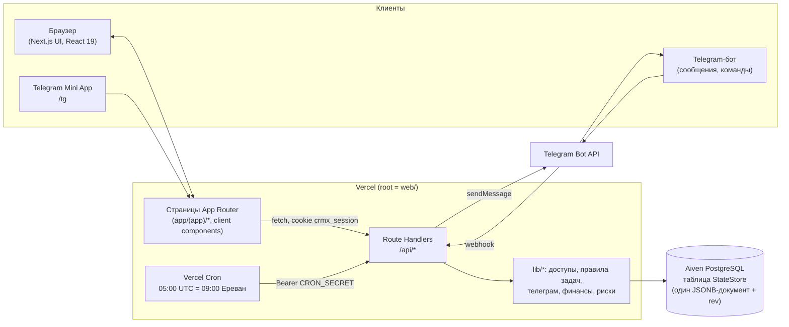
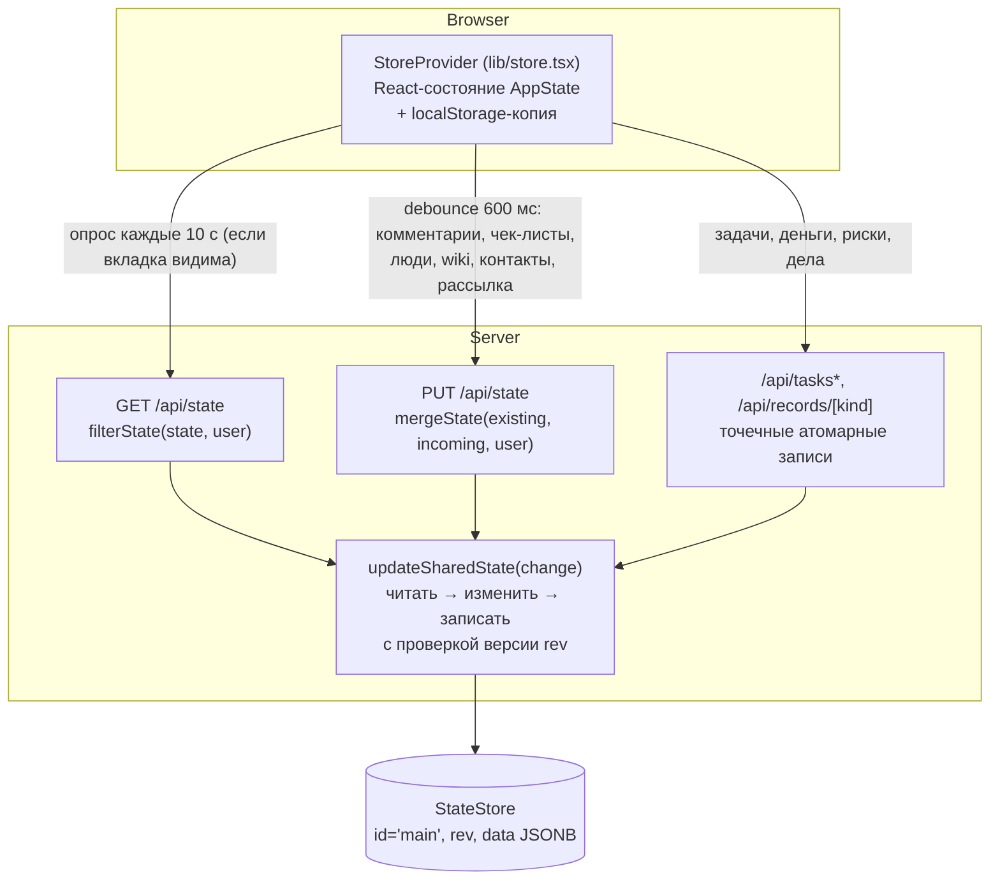
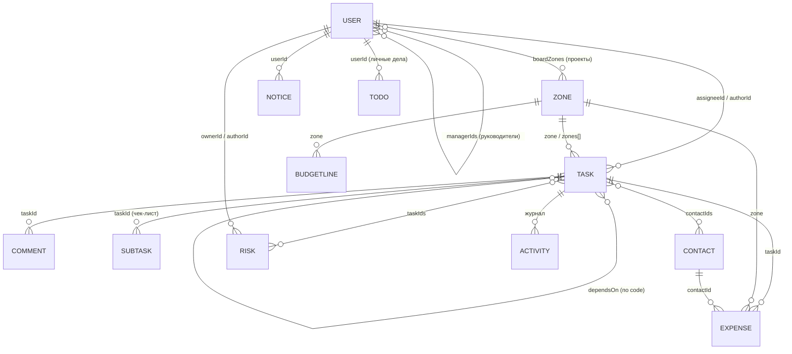
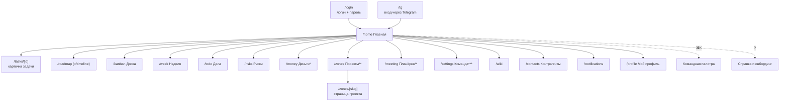

# CRM X — полное описание сервиса

> Документ собран по коду репозитория [RAZ-AR/CRM_X](https://github.com/RAZ-AR/CRM_X) на состояние после PR #25 (28.09.2026). Всё, что написано здесь, проверено по исходникам; расхождения между кодом и старой документацией вынесены в раздел 12.

---

## 1. Что это за продукт

**CRM X — операционная система запуска пространства в Ереване (кинотеатр «Москва»).** Это *не* sales-CRM: здесь нет воронок продаж и клиентов. Это трекер запуска нескольких точек одновременно: master-план, задачи, сроки, команда, бюджет, риски, подрядчики.

- **Прод:** https://crm-x-nine.vercel.app
- **Пользователи:** небольшая команда запуска (стартово 3 человека: Armen — Owner, Vladimir — креативный директор, Karina — маркетинг), дальше Owner добавляет людей сам.
- **Язык интерфейса:** русский. Время — по Еревану (UTC+4 круглый год).
- **Форм-факторы:** веб (десктоп + мобильная вёрстка), Telegram-бот, Telegram Mini App (CRM внутри Telegram без пароля).

### Проекты (в терминах кода — «зоны», `zone`)

| Проект | slug | Открытие | Комментарий |
| --- | --- | --- | --- |
| 🧇 WAFL | `wafl` | **28.10.2026** | + Telegram Mini App с лояльностью и геймификацией (для гостей) |
| 🍳 Dark Kitchen | `kitchen` | **10.11.2026** | |
| 📚 COMX | `comx` | 15.12.2026 (ориентир) | |
| ☕ CAFE | `cafe` | 15.01.2027 (ориентир) | |
| 🏛️ ОБЩИЕ | `common` | — | юрлица, бухгалтерия, демонтаж, общие вопросы |

Старт master-плана — 24.09.2026. Ремонт строго по очереди: WAFL → Dark Kitchen → COMX → CAFE. В каждом проекте: демонтаж → замер → планировка → дизайн → согласование → ремонт.

### 7 потоков (workstreams)

Каждая задача принадлежит одному потоку. По потокам считается готовность проекта.

| Поток | О чём |
| --- | --- |
| LEGAL & FINANCE | юрлица, договоры, бухгалтерия, банки, финмодель, разрешения |
| SPACE & BUILD | осмотр, демонтаж, ремонт, инженерия, безопасность |
| BRAND & MARKETING | бренд, соцсети, контент, PR, продвижение запуска |
| PRODUCT & APP | меню, рецептуры, техкарты, цены, приложение лояльности |
| EQUIPMENT & SUPPLY | оборудование, касса, упаковка, поставщики, закупки |
| PEOPLE & TRAINING | структура, найм, договоры, медкнижки, обучение, тестовые смены |
| LAUNCH & OPS | тест производства, soft launch, стандарты смен, агрегаторы, отчёты |

### Master-план в цифрах (`data/master-plan.csv`)

- **173 задачи**: WAFL 59, ОБЩИЕ 49, Dark Kitchen 41, COMX 12, CAFE 12.
- По потокам: SPACE & BUILD 44, PRODUCT & APP 33, EQUIPMENT & SUPPLY 24, BRAND & MARKETING 23, LAUNCH & OPS 19, LEGAL & FINANCE 15, PEOPLE & TRAINING 15.
- **42 задачи на critical path.**
- Исполнители: Armen 137, Vladimir 23, Karina 13 (то есть большая часть плана на Owner — это сигнал по нагрузке).
- Источник правды — `web/scripts/master-plan.py`; он пересобирает и CSV, и `web/lib/seed.ts` (стартовые данные).

---

## 2. Архитектура

### 2.1. Общая схема



### 2.2. Стек

| Слой | Технология |
| --- | --- |
| Фреймворк | **Next.js 16.3.4** (App Router), **React 19.2.8**, TypeScript 5 |
| Стили / иконки | Tailwind CSS 4, `lucide-react`, `clsx` |
| Данные | **PostgreSQL (Aiven)** через `@prisma/client` 5.22 (используется как драйвер для сырого SQL) |
| Хостинг | **Vercel** (root directory = `web`), cron через `web/vercel.json` |
| Уведомления | Telegram Bot API (без SDK, прямые `fetch`) |
| Аутентификация | собственная: scrypt-хэши паролей + HMAC-подписанная cookie `crmx_session` |
| Внешние сервисы | Aiven, Vercel, Telegram. Больше ничего |

Важно: в `web/CLAUDE.md`/`AGENTS.md` предупреждение, что версия Next.js «не та, что в обучающих данных» — перед изменениями нужно читать доки в `node_modules/next/dist/docs/`.

### 2.3. Ключевое архитектурное решение: «одно общее состояние»

Приложение **не использует реляционные таблицы по сущностям**. Вся рабочая информация — пользователи, проекты, задачи, комментарии, чек-листы, wiki, контакты, уведомления, бюджет, расходы, риски, дела, журнал — это **один JSON-объект `AppState`**, который хранится **одной строкой** в таблице `StateStore`.

Плюсы: очень простая модель, быстрая разработка, атомарные снимки, не нужны миграции схемы для каждой новой сущности. Минусы — см. раздел 11.



**Как устроена запись (оптимистичная блокировка):**

1. `updateSharedState(change)` читает строку (`data`, `rev`).
2. Выполняет функцию `change`, получает новое состояние.
3. Пишет `UPDATE ... WHERE id='main' AND rev = <прочитанная>`; `rev` увеличивается на 1.
4. Если кто-то успел записать раньше (0 обновлённых строк) — пауза 30–150+ мс и повтор до **8 раз**; потом `StateConflictError` («Данные одновременно меняют несколько человек — повторите действие»).
5. Побочные эффекты (Telegram) выполняются **после** записи, потому что `change` может исполниться несколько раз.

**Кэш чтения:** в памяти инстанса 3 секунды (`RECENT_MS`), чтобы опрос из нескольких вкладок не убивал БД.

**Миграции данных** — чистые функции в `applyMigrations`, применяются при каждом чтении и при необходимости сохраняются: переход на master-план от 24.09.2026, сброс стартовых учёток (`AUTH_VERSION = 2`), доступ Vladimir к потоку BRAND, переименование потоков (BRAND → BRAND & MARKETING и т. д.).

### 2.4. Слои кода

```
web/
├─ app/
│  ├─ login/, tg/, page.tsx        — вход, точка входа Mini App, редирект
│  ├─ (app)/*/page.tsx             — 18 экранов внутри оболочки AppShell
│  └─ api/*                        — 15 route handlers
├─ components/                     — TaskSheet, AppShell, CommandPalette, графики, вехи…
├─ lib/
│  ├─ types.ts                     — модель данных (AppState и все сущности)
│  ├─ store.tsx                    — клиентский стор: состояние, синхронизация с сервером
│  ├─ blobState.ts                 — хранилище: Postgres/локальный файл, версии, миграции
│  ├─ access.ts, publicUser.ts     — роли, права, фильтрация данных под пользователя
│  ├─ taskRules.ts                 — правила смены статусов, зависимости
│  ├─ auth.ts, session.ts, pin.ts  — пароли, сессии, лимит попыток
│  ├─ telegram.ts, digest.ts, reminders.ts, quickTask.ts, quickTodo.ts — Telegram
│  ├─ finance.ts, risks.ts, todos.ts — валидация и расчёты доменных записей
│  ├─ readiness.ts, milestones.ts, schedule.ts, agenda.ts, quality.ts — аналитика
│  └─ seed.ts (5470 строк)         — стартовые данные master-плана
├─ prisma/schema.prisma            — реляционная схема (не в боевом пути, см. 12)
└─ scripts/master-plan.py          — генерация плана
```

---

## 3. База данных

### 3.1. Что реально работает в проде

**PostgreSQL на Aiven**, подключение через `DATABASE_URL` (`postgresql://…?sslmode=require`).

Единственная таблица боевого пути (создаётся автоматически при первом обращении — `CREATE TABLE IF NOT EXISTS`, ручной `db push` не нужен):

```sql
CREATE TABLE "StateStore" (
  id         TEXT PRIMARY KEY,
  rev        INTEGER NOT NULL DEFAULT 0,      -- версия для оптимистичной блокировки
  data       JSONB   NOT NULL,                -- весь документ
  updated_at TIMESTAMPTZ NOT NULL DEFAULT now()
);
```

Строки:

| `id` | Что хранит |
| --- | --- |
| `main` | весь `AppState` (см. 3.2) |
| `session-secret` | случайный ключ подписи сессий (если не задан `SESSION_SECRET`) |

Без `DATABASE_URL` (локальная разработка) состояние лежит в файле `web/.local-store/state.json`. В проде без `DATABASE_URL` сервис возвращает понятную ошибку `StorageUnavailableError` (это сделано намеренно: иначе в обход хранилища работали бы стартовые пароли из кода).

### 3.2. Модель данных `AppState` (JSON внутри `main`)



| Коллекция | Ключевые поля | Примечания |
| --- | --- | --- |
| **users** | id, name, email (=логин), password (scrypt), role (`cpo`/`employee`), access (`owner`/`manager`/`marketer`/`staff`), permissions[], boardZones[], managerIds[], streams[], telegramChatId | `telegramChatId` и пароль **не** отдаются в браузер (`publicUser`: `telegramLinked: true/false`) |
| **zones** | slug, name, emoji, color, deadline | 5 проектов; `deadline` = дата открытия |
| **tasks** | id, **code** (GEN-01…), title, description, zone/zones[], assigneeId, authorId, participantIds[], startDate, due, priority, **status**, weight (1 или 3), criticalPath, **result** («готово когда»), workstream, wave, dependsOn[] (коды), contactIds[], attachments[], blockReason/blockUntil/blockFromStatus | статусы: `todo`, `in_progress`, `review`, `done`, `blocked` |
| **comments** | taskId, userId, text, reactions[] | реакции-эмодзи |
| **subtasks** | taskId, title, done | чек-лист задачи |
| **wiki** | title, body, zone/`all`, visibility (`cpo`/`zone`/`staff`) | страница `w1` — сам master-план, онбординг |
| **contacts** | name, company, kind (подрядчик/поставщик/партнёр/госорган/сотрудник), specialty, status (кандидат → переговоры → договор → в работе → завершено / отказ), phone, email, telegram, whatsapp, zone, notes | «Контрагенты» |
| **notices** | userId, text, taskId, kind, read | внутренние уведомления (колокольчик) |
| **broadcast** | text, emoji, authorId | рассылка Owner на главной |
| **budget** | zone, category (13 статей), amount, currency | план по статьям |
| **expenses** | title, zone, category, amount, currency (AMD/USD/EUR), status (`planned`/`invoiced`/`paid`), date, contactId, taskId | факт и обязательства |
| **fx** | USD, EUR (драмов за единицу), updatedAt | по умолчанию 385 / 450 |
| **risks** | title, zone, probability 1–3, impact 1–3, ownerId, planB, decideBy, taskIds[], status (`open`/`watch`/`closed`) | оценка = вероятность × влияние (1…9) |
| **todos** | userId, text, done, remindAt, repeat (`none`/`daily`/`weekdays`/`weekly`), remindedAt, taskId | личные дела, каждый видит только свои |
| **activity** | at, userId, taskId, kind (created/status/dates/assignee/edited/deleted/comment), text, days, criticalPath | журнал изменений, последние **1500** записей, пишет только сервер |
| служебные | `rev`, `authVersion` | |

Статьи бюджета: Первоначальные инвестиции · Ремонт и инженерия · Оборудование · Упаковка и мебель · IT и приложение · Юридическое и разрешения · Зарплаты · Аренда и коммунальные · Продукты и доставка · Маркетинг · Налоги · Резерв · Прочее.

### 3.3. Что есть в репозитории, но **не** используется в бою

- `web/prisma/schema.prisma` — реляционная схема из 8 моделей (User, Zone, Task, Comment, Subtask, WikiPage, Contact, Notice, Broadcast). Прежняя схема; в неё **нет** бюджета, рисков, дел, журнала. Код `web/lib/persist.ts` (загрузка/сохранение через эти модели) **нигде не импортируется**.
- `supabase/schema.sql` и зависимости `@supabase/*` — остаток от раннего варианта на Supabase; в коде не используются.
- `web/scripts/seed-aiven.ts`, `prisma/seed.mjs` — скрипты первичной загрузки.

---

## 4. Роли и доступы

### 4.1. Роли

| Роль | Что видит и может |
| --- | --- |
| **Owner** (`role: cpo`) | всё; правит и удаляет любые задачи; управляет командой, деньгами, проектами, рассылками; назначать/снимать Owner может только Owner |
| **Управляющий** (`manager`) | все задачи своих проектов: видит, ведёт статусы, правит сроки; по умолчанию Wiki, Контрагенты, страница/команда/roadmap/готовность проекта |
| **Маркетолог** (`marketer`) | поток BRAND & MARKETING в своих проектах + свои задачи; Wiki и Контрагенты |
| **Сотрудник** (`staff`) | свои задачи, задачи где участвует, задачи подчинённых; Wiki |

Дополнительно поверх роли:
- **permissions**: `manage_users` (управлять командой), `zone_page`, `zone_team_tasks`, `zone_team`, `zone_roadmap`, `zone_readiness`, `wiki`, `contacts`, `finance` («Деньги»), `marketing_all_zones`.
- **streams**: человеку можно открыть поток целиком (напр. Vladimir видит весь BRAND & MARKETING).
- **managerIds**: руководители человека (0, 1 или несколько) — видят его задачи; иерархия рекурсивная (подчинённые подчинённых).
- **boardZones**: проекты человека.

### 4.2. Матрица правил по задаче

| Действие | Кто может |
| --- | --- |
| **Видеть** | Owner / исполнитель / автор / участник / руководитель исполнителя (рекурсивно) / открытый поток / управляющий проекта (маркетолог — только маркетинг) |
| **Менять статус, чек-лист, комментарий, вложение, «готово когда», блок, контрагентов** | всё из «видеть» кроме чистых наблюдателей (исполнитель, участники, потоки, менеджеры проекта) |
| **Править название, срок, вес, critical path, исполнителя** | Owner, кто с `manage_users`, автор, управляющий проекта |
| **Удалять** | Owner — любую; остальные — только созданные ими |

Сервер (`PATCH /api/tasks/[id]`) сам разделяет поля: исполнитель может присылать только «рабочие» поля (`status, result, blockReason, blockUntil, blockFromStatus, attachments, contactIds`), остальное отбрасывается.

### 4.3. Что фильтруется до отправки в браузер (`filterState`)

- Задачи — только видимые; Owner и `manage_users` — все.
- Комментарии / чек-листы / журнал — только по видимым задачам (удалённые задачи в журнале видит только Owner).
- Уведомления — только свои. Дела — только свои.
- Wiki и контакты — по правам и проектам.
- Бюджет, расходы, курсы — только Owner и `finance`.
- Риски видят все, но ссылки на недоступные задачи вырезаются.
- Пароли и Telegram chat_id не уходят никому.

---

## 5. Бизнес-правила задач

**Статусы и доска:** `Не начато · бэклог` → `В работе` → `На проверке` → `Готово`; **`Заблокировано`** — отдельная колонка справа (не шаг пайплайна). Блок можно поставить только внутри карточки задачи.

Правила перехода (`lib/taskRules.ts`, проверяются и на клиенте, и на сервере):

1. **Зависимости.** Нельзя перевести в «В работе / На проверке / Готово», пока не закрыты задачи из `dependsOn` (по кодам). Исключение: Owner и `manage_users`.
2. **«Готово когда» (`result`).** Без заполненного результата нельзя на проверку и в готово.
3. **Блок.** Нужен срок блока (день / неделя / месяц / навсегда) и комментарий-причина.

**Готовность.** Взвешенный процент закрытых задач: обычная задача весит **1**, задача critical path — **3**. Считается автоматически: по проекту, по каждому из 7 потоков, по вехам. Ручного ввода нет.

**Каскад сроков (`lib/schedule.ts`).** Сдвиг даты задачи автоматически сдвигает зависимые (длительность сохраняется, цепочка идёт дальше). Раньше они не подтягиваются. Перед сохранением пользователь видит превью сдвигов на Roadmap; сохранение идёт по одной задаче с остановкой при первой ошибке.

**Вехи (`lib/milestones.ts`).** Девять стандартных вех проекта собираются из задач по потоку и названию: Демонтаж → Замер и планировка → Дизайн → Согласование → Ремонт → Оборудование → Команда → Soft launch → Открытие. Состояние вехи: готово / в работе / просрочено / впереди.

**Проверка данных (`lib/quality.ts`).** Задача считается «грязной», если нет «готово когда», исполнителя, срока или потока; начало позже конца; зависимость не найдена; стартует раньше, чем заканчивается зависимость.

**Журнал.** Каждое создание, смена статуса, срока, исполнителя, редактирование, удаление, комментарий пишется сервером в `activity`.

---

## 6. Экраны и навигация

### 6.1. Карта экранов



`*` только Owner и `finance` · `**` в меню только у Owner · `***` Owner и `manage_users`.

Редиректы: `/` → `/home` или `/login`; `/new` → `/kanban`; `/roadmap` = `/timeline`. `/team` — заглушка (список людей с числом активных задач), в меню не выводится.

### 6.2. Меню

- **Owner:** Главная · Дела · Неделя · Roadmap · Доска · Проекты · Планёрка · Деньги · Риски · Команда · Wiki · Контрагенты.
- **Остальные:** Главная · Дела · Неделя · Roadmap · Доска · (доски своих проектов) · Wiki* · Контрагенты* · Риски · Деньги* · Команда*. (*по правам).
- Меню складывается (состояние запоминается в браузере); в шапке — поиск/палитра ⌘K, колокольчик уведомлений, справка.

### 6.3. Описание экранов

| Экран | Путь | Что делает |
| --- | --- | --- |
| **Вход** | `/login` | Логин (нечувствителен к регистру) + пароль. Лимит: 5 ошибок за 15 минут на пару IP+логин |
| **Вход из Telegram** | `/tg` | Mini App: проверка подписи `initData`, выдача сессии тому, кто привязал этот Telegram |
| **Главная** | `/home` | Приветствие; **рассылка Owner** (баннер); обратный отсчёт до ближайшего запуска; готовность по 7 потокам; нагрузка по неделям до запусков; **Roadmap по основным вехам**; плитки проектов; бюджет (осталось / план); топ рисков; загрузка команды на неделе; «Сегодня», «Важное», «Что изменилось» (журнал); «Проверить данные» |
| **Дела** | `/todo` | Личный список с напоминаниями: быстрые пресеты («Через час», «Сегодня 18:00», «Завтра 9:00», «Пн 9:00»), повтор, привязка к задаче; группы «просрочено / сегодня / позже / готово» |
| **Неделя** | `/week` | Кто что делает: задачи, которые идут в выбранную неделю, + хвосты прошлых; группировка по людям; фильтр по проекту; листание недель |
| **Roadmap** | `/roadmap`, `/timeline` | Диаграмма Ганта по 7 потокам с вехами запусков; масштаб; фильтр по сотруднику; перенос сроков с каскадом и превью |
| **Доска** | `/kanban`, `/kanban?zone=…` | Канбан: 4 колонки + «Заблокировано»; drag-and-drop; фильтры (проект, исполнитель, срок); создание задачи; статусы в один клик |
| **Карточка задачи** | `/tasks/[id]` и модальное окно | Название, проект(ы), поток, исполнитель, срок, приоритет, critical path; «готово когда»; статус; блок с причиной и сроком; зависимости («ждёт» / «открывает»); контрагенты; чек-лист; вложения; комментарии с реакциями; удаление |
| **Проекты** | `/zones`, `/zones/[slug]` | Список проектов с готовностью и 7 индикаторами потоков; страница проекта: готовность по потокам, задачи |
| **Планёрка** | `/meeting` | Повестка собирается сама: запуски · закрыто · просрочено · заблокировано · сдвиги critical path · ждут проверки · данные поправить · сдать на след. неделе. Копирование и **рассылка в Telegram всей команде** (Owner) |
| **Деньги** | `/money` | Бюджет по проектам и 13 статьям, расходы (план / счёт / оплачено), 3 валюты с курсами, остаток, ближайшие и просроченные платежи, привязка к контрагенту и задаче |
| **Риски** | `/risks` | Реестр: вероятность × влияние (1–9, цветовая шкала), ответственный, план Б, «решить до», связанные задачи, статус |
| **Команда и доступы** | `/settings` | Добавить человека (логин, стартовый 4-значный PIN, роль, проекты, руководители); менять роль, проекты, руководителей, права, открытые потоки, логин/пароль; добавить проект; рассылка |
| **Wiki** | `/wiki` | Страницы по проектам с видимостью; master-план и онбординг |
| **Контрагенты** | `/contacts` | Подрядчики, поставщики, партнёры, госорганы с воронкой статусов; звонок/Telegram/WhatsApp по клику; привязка к задачам |
| **Уведомления** | `/notifications` | Новые / прочитанные |
| **Профиль** | `/profile` | Смена пароля (другие устройства разлогиниваются); подключение/отключение Telegram; у Owner — «Разослать утренний список сейчас» |
| **⌘K / Ctrl+K** | везде | Поиск по задачам, проектам, контрагентам, разделам; создание задачи или дела из введённого текста |
| **Справка** | везде | Онбординг из 7 шагов + FAQ по каждому разделу (`lib/help.ts`) |

### 6.4. Клиентская синхронизация (важно для UX)

- При старте — `GET /api/state`; если сервера нет, поднимается копия из `localStorage` (ключ `crmx-v10`).
- **Опрос раз в 10 секунд**, только для видимой вкладки. Если есть несохранённые локальные правки — опрос их не затирает.
- Комментарии, чек-листы, люди, wiki, контакты, рассылка сохраняются с задержкой **0,6 с** одним `PUT /api/state` (задачи в него не входят).
- Задачи, деньги, риски, дела — **сначала сервер, потом экран** (при ошибке пользователь видит текст ошибки).
- Все запросы одного браузера идут строго по очереди.
- Уведомления «просрочено» для текущего пользователя генерируются на клиенте.

---

## 7. API

Аутентификация везде — cookie `crmx_session` (httpOnly, sameSite=lax, secure в проде, 30 дней). Проверки прав выполняются **на сервере**, не только в интерфейсе.

| Метод и путь | Кто | Назначение |
| --- | --- | --- |
| `POST /api/login` | все | Вход; лимит попыток; перехэширование старого пароля при первом входе |
| `POST /api/logout` | все | Выход |
| `POST /api/password` | авторизованный | Смена своего пароля (нужен текущий); переустанавливает cookie |
| `GET /api/state` | авторизованный | Отфильтрованный `AppState`; заодно (после ответа) проверяет напоминания для Telegram |
| `PUT /api/state` | авторизованный | Слияние не-задачных данных (`mergeState`); людей/проекты/wiki/рассылку принимает только Owner и `manage_users` |
| `POST /api/tasks` | авторизованный | Создать задачу (автор = текущий пользователь; идемпотентно по id); уведомление исполнителю в Telegram |
| `PATCH /api/tasks/[id]` | по правам 4.2 | Изменить поля; правила статусов; журнал; Telegram-уведомления |
| `DELETE /api/tasks/[id]` | Owner / автор | Удалить с чисткой зависимостей, комментариев, чек-листа, уведомлений, ссылок из рисков и расходов |
| `PUT/DELETE /api/records/[kind]` | `budget`, `expenses`, `fx` — Owner и `finance`; `risks`, `todos` — все | Точечная запись бюджета, расходов, курсов, рисков, личных дел |
| `POST /api/meeting/send` | Owner | Разослать повестку планёрки всем с Telegram |
| `GET /api/telegram/link` | авторизованный | Одноразовая ссылка `t.me/<бот>?start=<код>` (30 мин); заодно ставит webhook и кнопку меню |
| `POST /api/telegram/unlink` | авторизованный | Отвязать Telegram |
| `POST /api/telegram/auth` | по подписи Telegram | Вход из Mini App |
| `POST /api/telegram/webhook` | Telegram (секрет в заголовке) | Приём сообщений бота |
| `POST /api/telegram/digest` | Owner | Разослать утренний список сейчас |
| `GET /api/cron/daily` | Vercel Cron (`Bearer CRON_SECRET`) | Напоминания + утренние списки |

Сообщения об ошибках хранилища переводятся в понятный текст (неверный пароль БД, база спит, адрес недоступен и т. п.).

---

## 8. Telegram-интеграция

**Привязка:** Профиль → «Подключить Telegram» → ссылка с подписанным кодом (действует 30 мин) → «Старт» в боте. Webhook и кнопка меню «CRM» ставятся автоматически.

**Что приходит в Telegram:**
- 🆕 назначена задача (создана или переназначена);
- 🟣 / 🟢 / ⛔ задача ушла на проверку / выполнена / заблокирована — **автору** задачи (с причиной блока);
- ☀️ **каждый день в 09:00 по Еревану**: просрочено, сдать сегодня, в работе, пора начать, заблокировано, открытые дела, сколько дней до ближайших запусков; у Owner — ещё сводка просрочек команды и critical path;
- ⏰ напоминание по личному делу;
- 📋 повестка планёрки (рассылает Owner).

**Что можно делать из бота:**

| Сообщение | Результат |
| --- | --- |
| Обычный текст: `Купить упаковку до 15.10 #wafl @karina` | Задача в бэклоге. Срок: `до ДД.ММ` / `ДД.ММ.ГГГГ` / `сегодня` / `завтра` (по умолчанию +3 дня). Проект: `#wafl #kitchen #cafe #comx #common` (по умолчанию ОБЩИЕ). Исполнитель: `@логин` — назначать других может Owner или руководитель, иначе задача пишется на автора |
| `дело: позвонить электрику завтра 10:00` (также `/todo`, `напомни …`) | Личное дело с напоминанием; время: `18:00`, `сегодня`, `завтра`, `ДД.ММ`, `через 2 часа`; повтор: «каждый день / по будням / каждую неделю» |
| `/today` | Список на сегодня |
| `/todos` | Мои дела |
| `/stop` | Отключить уведомления |

**Mini App:** кнопка «CRM» в меню бота открывает `/tg` → проверка подписи `initData` (HMAC от токена бота, не старше суток) → сессия без пароля.

**Планировщик.** На тарифе Vercel Hobby нет точного планировщика, поэтому напоминания отправляются «попутно»: при каждом опросе состояния (не чаще раза в 20 с на инстанс) и в утреннем cron. Если все офлайн — напоминание придёт при следующем заходе или утром. Пока CRM открыта, напоминание всплывает в браузере (плюс системное уведомление, если разрешено).

**Защита webhook:** секрет в заголовке `x-telegram-bot-api-secret-token`, производный от ключа сессий; `max_connections: 1`, чтобы сообщения обрабатывались по одному.

---

## 9. Безопасность

- **Пароли:** scrypt с солью; старые открытые пароли перехэшируются при первом входе.
- **Сессия:** `userId.exp.отпечаток_пароля.HMAC-подпись`; отпечаток пароля в токене → **смена пароля разлогинивает остальные устройства**.
- **Ключ подписи:** `SESSION_SECRET`, иначе случайный ключ, сохранённый в БД. Смена → все разлогинены.
- **Brute-force:** 5 ошибок / 15 мин на IP+логин (счётчик в памяти инстанса — на serverless он не общий между инстансами, см. 11).
- **Cron:** только с `Bearer CRON_SECRET`.
- **Сервер — источник правды:** права проверяются в API, клиент получает уже отфильтрованные данные.
- Эндпоинта сброса базы нет.

---

## 10. Развёртывание и конфигурация

**Переменные окружения (Vercel):**

| Переменная | Обязательна | Назначение |
| --- | --- | --- |
| `DATABASE_URL` | **да** | URI Aiven PostgreSQL (`?sslmode=require`) |
| `SESSION_SECRET` | рекомендуется | ключ подписи сессий (`openssl rand -hex 32`) |
| `TELEGRAM_BOT_TOKEN` | для Telegram | токен от @BotFather |
| `CRON_SECRET` | для утренней рассылки | защита cron-эндпоинта |
| `APP_URL` | нет | базовый адрес для ссылок в сообщениях (иначе берётся из запроса) |

**Шаги:** GitHub → Aiven (PostgreSQL) → Vercel (Root Directory = `web`) → переменные → Deploy. Если на Vercel ошибка подключения к БД — в Aiven разрешить IP `0.0.0.0/0` (Allowed IP addresses), подождать 1–2 минуты.

**Cron:** `web/vercel.json` → `/api/cron/daily`, `0 5 * * *` (09:00 Ереван).

**Локально:** `cd web && npm install && npm run dev` → http://localhost:3000. Без `DATABASE_URL` данные в `web/.local-store/state.json`.

**История разработки (50 коммитов, PR #1–#25):** master-план и команда (24.09) → неделя, Roadmap, Telegram-уведомления, журнал и планёрка, контрагенты, деньги и риски, атомарные записи, «Дела», ⌘K, онбординг, роли команды (25.09) → переход с Vercel Blob на Postgres из-за месячного лимита операций Blob (28.09).

---

## 11. Ограничения и технический долг (что стоит знать продакту)

1. **Весь стейт — один документ.** Каждая запись переписывает весь JSON. Сейчас это 173 задачи + wiki + журнал — нормально, но растёт с командой и историей.
2. **Вложения хранятся как `dataUrl` прямо в JSON** (`Task.attachments`). Несколько файлов в задачах быстро раздуют документ, замедлят каждый запрос и упрутся в лимиты. Нужно вынести файлы в объектное хранилище (S3/R2/Vercel Blob) и хранить только ссылки.
3. **Конкурентные записи** решены повторами (до 8). Под нагрузкой из 10+ активных людей возможны сообщения о конфликте.
4. **Опрос вместо realtime.** Изменения коллег появляются с задержкой до 10 секунд (+ до 3 с кэша сервера). Каждая открытая вкладка = запрос раз в 10 с.
5. **Rate limit входа в памяти инстанса.** На serverless не общий между инстансами — защита частичная.
6. **Нет полноценного планировщика.** Напоминания «попутно» и утром; при отсутствии онлайн-пользователей приходят с задержкой.
7. **Нет поиска/фильтров на уровне БД, нет отчётов и экспорта** (кроме копирования повестки планёрки).
8. **Нет резервных копий по коду.** Полагаемся на бэкапы Aiven; в приложении нет «выгрузить всё».
9. **Мёртвый код и артефакты:** `prisma/schema.prisma`, `lib/persist.ts`, `supabase/schema.sql`, `@supabase/*` в зависимостях, шаблонный `web/README.md`. Путают новичков и попадают в билд зависимостей.
10. **Стартовые учётки** (Armen 1111, Vladimir 2222, Karina 3333) лежат в `seed.ts` открытым текстом; после первого входа перехэшируются, но пароли из репозитория нужно сменить сразу.
11. **Нет тестов и CI** в репозитории (нет тестового раннера, нет `.github/workflows`).
12. **Приложение лояльности WAFL** (Telegram Mini App для гостей) упомянуто в плане как задачи PRODUCT & APP, но в этом репозитории его кода нет — это отдельный продукт.

---

## 12. Расхождения между документацией и кодом

| Где | Что написано | Что в коде |
| --- | --- | --- |
| `README.md` | «Общий стейт в Vercel Blob (+ опционально Aiven Postgres)» | С PR #25 общий стейт **только в Postgres**; Blob не используется |
| `DEPLOY.md` | «Пока `DATABASE_URL` нет — данные остаются в браузере (localStorage)» | В проде без `DATABASE_URL` сервис отвечает ошибкой хранилища; локально — файл `.local-store` |
| `DEPLOY.md` | «`npx prisma db push` — создать таблицы» | Не нужно: `StateStore` создаётся сам. Prisma-таблицы боевым кодом не читаются |
| `DEPLOY.md` | «`SESSION_SECRET`… без неё ключ берётся из `BLOB_READ_WRITE_TOKEN`» | Без неё ключ генерируется и хранится в БД (`session-secret`) |
| `README.md` | «Уведомления, Wiki, контакты, команда» | Плюс: Дела, Неделя, Roadmap, Планёрка, Деньги, Риски, ⌘K, Telegram Mini App |

Рекомендуется обновить `README.md`/`DEPLOY.md` и удалить мёртвый код одним PR.
